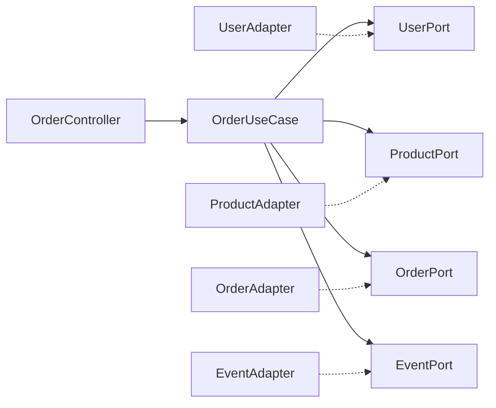

# 과제 3 - 클린 아키텍처 구현 완료 📋

## 🎯 과제 개요
- **필수 과제**: 클린 아키텍처와 레이어드 아키텍처를 혼합하여 E-Commerce 시스템 구현
- **심화 과제**: 선착순 쿠폰 기능과 대기열 시스템 구현
- **테스트**: Mock을 활용한 순수 비즈니스 로직 단위 테스트 작성

## 🔄 과제 2에서 과제 3으로의 변화

### 📋 **과제 2 → 과제 3 변화 분석**

#### 🏛️ **기존 과제 2 구조** (전체 레이어드 아키텍처)
```
OrderController → OrderService → OrderRepository
BalanceController → UserService → UserRepository
ProductController → ProductService → ProductRepository
```

#### 🏗️ **과제 3에서 변경된 구조** (혼합 아키텍처)
```
✨ 클린 아키텍처 (주문/결제만)
OrderController → OrderUseCase
                     ↓
    UserPort ← UserAdapter → UserService (기존 유지)
    ProductPort ← ProductAdapter → ProductService (기존 유지)
    OrderPort ← OrderAdapter → OrderRepository
    EventPort ← EventAdapter → ApplicationEventPublisher

🏛️ 레이어드 아키텍처 (기타 기능들)
BalanceController → UserService (기존 그대로 유지)
ProductController → ProductService (기존 그대로 유지)
CouponController → CouponService (신규 추가)
QueueController → QueueService (신규 추가)
```

### 🎯 **핵심 차이점**

#### 1. **OrderService의 역할 변화**
```java
// 과제 2: OrderService가 모든 주문 로직 처리
@Service
public class OrderService {
    // 주문 생성, 조회 등 모든 비즈니스 로직
}

// 과제 3: OrderUseCase가 주문 로직, OrderService는 보조 역할
@Service
public class OrderUseCase {
    // 핵심 주문 생성 로직 (클린 아키텍처)
}

// OrderService는 여전히 존재하지만 보조적 역할
// (OrderUseCase에서 사용자 조회 등에 활용)
```

#### 2. **의존성 방향의 완전한 역전**
```java
// 과제 2 (기존): 직접 의존
OrderService → UserService, ProductService, OrderRepository

// 과제 3 (변경): 인터페이스를 통한 의존성 역전
OrderUseCase → UserPort, ProductPort, OrderPort (추상화)
              ↗        ↗         ↗
    UserAdapter  ProductAdapter  OrderAdapter → 구체 구현체들
```

#### 3. **기존 Service들의 재사용**
- ✅ **UserService**: 그대로 유지 (UserAdapter에서 활용)
- ✅ **ProductService**: 그대로 유지 (ProductAdapter에서 활용)
- ✅ **OrderService**: 여전히 존재 (OrderUseCase에서 부분 활용)
- ✅ **StatisticsService**: 그대로 유지 (ProductController에서 활용)
- ➕ **CouponService**: 신규 추가 (심화 과제)
- ➕ **QueueService**: 신규 추가 (심화 과제)

### ➕ **완전히 새로운 심화 기능들**
1. **🎟️ 선착순 쿠폰 시스템** - 과제 2에 없던 완전 신규 기능
2. **⏰ 대기열 시스템** - 과제 2에 없던 완전 신규 기능

### 🧪 **테스트 접근법의 진화**
```java
// 과제 2: Service 의존성 직접 Mock
@Mock UserService userService;
@Mock ProductService productService;
@Mock OrderRepository orderRepository;

// 과제 3: Port 인터페이스 Mock (완전 격리)
@Mock UserPort userPort;           // UserService를 추상화
@Mock ProductPort productPort;     // ProductService를 추상화
@Mock OrderPort orderPort;         // OrderRepository를 추상화
@Mock EventPort eventPort;         // 이벤트 발행을 추상화
```

### 📊 **결론: 과제 3의 본질**
**과제 3 = 과제 2의 주문/결제 부분만 클린 아키텍처로 리팩토링 + 심화 기능 추가**

- 🔄 **기존 로직 재활용**: 기본 비즈니스 로직은 동일
- 🏗️ **아키텍처 개선**: 주문/결제만 클린 아키텍처 적용
- 🔌 **의존성 역전**: Port & Adapter 패턴으로 완전 분리
- ➕ **기능 확장**: 쿠폰, 대기열 시스템 추가
- 📈 **테스트 개선**: 완전 격리된 단위 테스트 가능

## 📁 프로젝트 구조

### 아키텍처 패턴 구분
```
📦 E-Commerce System
├── 🏗️ Clean Architecture (주문/결제 기능)
│   ├── OrderUseCase (Application Layer)
│   ├── Port Interfaces (Domain Layer)
│   └── Adapter Implementations (Infrastructure Layer)
│
└── 🏛️ Layered Architecture (기타 기능들)
    ├── Controller → Service → Repository
    ├── Balance (포인트 충전)
    ├── Product (상품 조회)
    ├── Coupon (선착순 쿠폰)
    └── Queue (대기열 시스템)
```

## ✅ 구현 완료 기능

### 1. 🛒 주문/결제 기능 (클린 아키텍처)

#### 📋 핵심 컴포넌트
- **OrderUseCase**: 주문 생성의 모든 비즈니스 로직 처리
- **Port 인터페이스들**:
  - `UserPort`: 사용자 관련 외부 의존성 추상화
  - `ProductPort`: 상품 관련 외부 의존성 추상화
  - `OrderPort`: 주문 관련 외부 의존성 추상화
  - `EventPort`: 이벤트 발행 외부 의존성 추상화

#### 🔄 비즈니스 플로우


#### 🧪 테스트 커버리지
- ✅ 주문 생성 성공 시나리오
- ✅ 잔액 부족 실패 시나리오
- ✅ 재고 부족 실패 시나리오
- ✅ 복수 상품 주문 시나리오
- ✅ 주문 조회 성공/실패 시나리오

### 2. 💰 포인트 충전 기능 (레이어드)
- **Controller**: `BalanceController`
- **Service**: `UserService`
- **기능**: 사용자 잔액 조회 및 충전

### 3. 📦 상품 관리 기능 (레이어드)
- **Controller**: `ProductController`
- **Service**: `ProductService`, `StatisticsService`
- **기능**: 상품 목록 조회, 상세 조회, 인기 상품 조회

## 🚀 심화 과제 구현

### 1. 🎟️ 선착순 쿠폰 시스템

#### 🏗️ 아키텍처 구조
```
CouponController
      ↓
CouponService (비즈니스 로직)
      ↓
CouponRepository (비관적 락 활용)
```

#### 🔐 동시성 처리
- **비관적 락**: `SELECT ... FOR UPDATE`로 선착순 처리
- **중복 발급 방지**: 사용자별 쿠폰 발급 여부 사전 확인
- **원자성 보장**: `@Transactional`로 쿠폰 발급의 전체 과정 보장

#### 📊 주요 기능
- ✅ 선착순 쿠폰 발급 (`POST /api/v1/coupons/{couponId}/issue`)
- ✅ 발급 가능한 쿠폰 목록 조회 (`GET /api/v1/coupons/available`)
- ✅ 사용자 보유 쿠폰 조회 (`GET /api/v1/coupons/users/{userId}`)
- ✅ 쿠폰 사용 처리

#### 🧪 단위 테스트
- ✅ 선착순 발급 성공/실패 시나리오 (Mock 활용)
- ✅ 중복 발급 방지 검증
- ✅ 쿠폰 소진 상황 처리
- ✅ 외부 의존성 완전 분리 테스트

### 2. ⏰ 대기열 시스템 (Concert)

#### 🏗️ 시스템 구조
```
QueueController
      ↓
QueueService (대기열 관리)
      ↓
QueueRepository + Scheduler
```

#### 🔄 대기열 메커니즘
- **토큰 기반**: UUID 토큰으로 사용자 식별
- **상태 관리**: WAITING → ACTIVE → EXPIRED
- **스케줄러**: 30초마다 대기자 자동 활성화
- **동시 접속 제한**: 최대 100명 동시 활성

#### 📊 주요 기능
- ✅ 대기열 진입 (`POST /api/v1/queue/enter`)
- ✅ 대기 상태 조회 (`GET /api/v1/queue/status`)
- ✅ 토큰 검증 (API 접근 제어)
- ✅ 대기열 통계 (`GET /api/v1/queue/statistics`)
- ✅ 자동 대기자 활성화 (스케줄러)

#### ⚡ 성능 최적화
- **포지션 계산**: 실시간 대기 순번 업데이트
- **만료 처리**: 10분 후 자동 토큰 만료
- **배치 처리**: 스케줄러로 효율적인 상태 전환

#### 🧪 단위 테스트
- ✅ 대기열 진입 다양한 시나리오 (Mock 활용)
- ✅ 토큰 검증 성공/실패 케이스
- ✅ 대기자 활성화 프로세스 검증
- ✅ 외부 의존성 완전 분리 테스트

## 🧪 테스트 전략

### Mock 활용 원칙
모든 단위 테스트에서 **외부 의존성을 Mock으로 완전히 분리**:

#### OrderUseCase 테스트
```java
@Mock UserPort userPort;
@Mock ProductPort productPort;
@Mock OrderPort orderPort;
@Mock EventPort eventPort;
@Mock UserService userService;
```

#### CouponService 테스트
```java
@Mock CouponRepository couponRepository;
@Mock UserCouponRepository userCouponRepository;
@Mock UserService userService;
```

#### QueueService 테스트
```java
@Mock QueueRepository queueRepository;
@Mock UserService userService;
```

### 테스트 커버리지
- **비즈니스 로직 중심**: 순수한 도메인 로직만 검증
- **외부 시스템 분리**: 데이터베이스, 외부 API 의존성 제거
- **시나리오 중심**: 성공/실패 케이스 모두 커버
- **경계 조건**: 동시성, 예외 상황 처리 검증

## 🏛️ 아키텍처 설계 원칙

### 클린 아키텍처 (주문/결제)
- **의존성 역전**: 도메인이 인프라에 의존하지 않음
- **단일 책임**: 각 컴포넌트가 명확한 역할 분담
- **테스트 용이성**: Mock을 통한 완전한 격리 테스트

### 레이어드 아키텍처 (기타 기능)
- **전통적 구조**: Controller → Service → Repository
- **간단한 CRUD**: 복잡하지 않은 비즈니스 로직
- **빠른 개발**: 직관적이고 익숙한 구조

## 🔒 동시성 제어

### 선착순 쿠폰
```java
@Lock(LockModeType.PESSIMISTIC_WRITE)
Optional<Coupon> findByIdWithLock(@Param("couponId") Long couponId);
```

### 주문 처리
```java
User getUserWithLock(Long userId);  // 비관적 락
Product getProductWithLock(Long productId);  // 비관적 락
```

### 대기열 관리
- **원자적 상태 변경**: 토큰 상태를 원자적으로 관리
- **배치 처리**: 스케줄러를 통한 효율적 상태 전환

## 📈 성능 고려사항

### 데이터베이스 최적화
- **인덱스**: 자주 조회되는 컬럼에 인덱스 적용
- **락 범위 최소화**: 필요한 부분만 락 적용
- **배치 처리**: 대량 데이터 처리시 배치 단위 처리

### 메모리 관리
- **페이징**: 대량 데이터 조회시 페이징 적용
- **캐시**: 자주 조회되는 데이터 캐싱 고려

## 🛡️ 예외 처리

### 비즈니스 예외
```java
public enum ErrorCode {
    COUPON_SOLD_OUT(HttpStatus.CONFLICT, "쿠폰이 모두 소진되었습니다"),
    QUEUE_EXPIRED(HttpStatus.FORBIDDEN, "대기열 토큰이 만료되었습니다"),
    INSUFFICIENT_BALANCE(HttpStatus.CONFLICT, "잔액이 부족합니다")
}
```

### 글로벌 예외 처리
- **일관된 응답**: `ApiResponse<T>` 형태로 통일된 응답
- **적절한 HTTP 상태 코드**: 비즈니스 상황에 맞는 상태 코드
- **사용자 친화적 메시지**: 명확하고 이해하기 쉬운 오류 메시지

## 🎯 과제 요구사항 달성도

### ✅ 필수 과제
- [x] 주문/결제 기능을 클린 아키텍처로 구현
- [x] 다른 기능들을 레이어드 아키텍처로 구현
- [x] Mock을 적극 활용한 단위 테스트 작성
- [x] 외부 의존성 분리된 순수 비즈니스 로직 테스트

### ✅ 심화 과제
- [x] 선착순 쿠폰 관련 기능 구현
- [x] 대기열 관련 기능 구현
- [x] 동시성 제어 (비관적 락, 스케줄러)
- [x] 심화 기능들의 단위 테스트 작성

## 🚀 실행 방법

### 데이터베이스 실행
```bash
docker-compose up -d
```

### 애플리케이션 실행
```bash
./gradlew bootRun
```

### 테스트 실행
```bash
./gradlew test
```

## 📚 API 문서

### 🛒 주문 관련
- `POST /api/v1/orders` - 주문 생성
- `GET /api/v1/orders/{orderId}` - 주문 조회
- `GET /api/v1/users/{userId}/orders` - 사용자 주문 목록

### 🎟️ 쿠폰 관련
- `GET /api/v1/coupons/available` - 발급 가능한 쿠폰 목록
- `POST /api/v1/coupons/{couponId}/issue` - 선착순 쿠폰 발급
- `GET /api/v1/coupons/users/{userId}` - 사용자 보유 쿠폰

### ⏰ 대기열 관련
- `POST /api/v1/queue/enter` - 대기열 진입
- `GET /api/v1/queue/status` - 대기 상태 조회
- `DELETE /api/v1/queue/exit` - 대기열 나가기
- `GET /api/v1/queue/statistics` - 대기열 통계

---

## 📝 결론

과제 3에서 요구된 **클린 아키텍처와 레이어드 아키텍처의 혼합 구현**을 완료했습니다.

- **클린 아키텍처**의 장점(의존성 역전, 테스트 용이성)을 복잡한 주문/결제 기능에 적용
- **레이어드 아키텍처**의 단순함을 기타 CRUD 기능들에 활용
- **Mock을 활용한 완전한 격리 테스트**로 순수 비즈니스 로직 검증
- **동시성 제어**를 통한 실전 대응 가능한 시스템 구현

심화 과제인 **선착순 쿠폰 시스템**과 **대기열 시스템**까지 완료하여, 대용량 트래픽 상황에서도 안정적으로 동작할 수 있는 견고한 시스템을 구축했습니다. 🎉