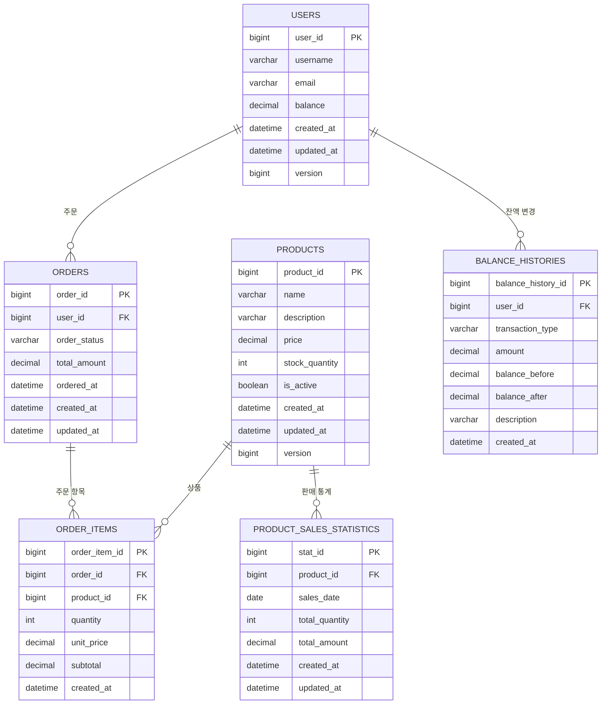

# ERD (Entity Relationship Diagram)

## 개요
E-Commerce 상품 주문 서비스의 데이터베이스 스키마 설계입니다.

## ERD 다이어그램



## 테이블 상세 설계

### 1. USERS (사용자)
사용자 정보와 잔액을 관리합니다.

| Column | Type | Constraint | Description |
|--------|------|------------|-------------|
| user_id | BIGINT | PRIMARY KEY, AUTO_INCREMENT | 사용자 고유 ID |
| username | VARCHAR(50) | NOT NULL, UNIQUE | 사용자명 |
| email | VARCHAR(100) | NOT NULL, UNIQUE | 이메일 주소 |
| balance | DECIMAL(15,2) | NOT NULL, DEFAULT 0 | 현재 잔액 |
| created_at | DATETIME | NOT NULL, DEFAULT CURRENT_TIMESTAMP | 생성일시 |
| updated_at | DATETIME | NOT NULL, DEFAULT CURRENT_TIMESTAMP ON UPDATE CURRENT_TIMESTAMP | 수정일시 |
| version | BIGINT | NOT NULL, DEFAULT 0 | 낙관적 락용 버전 |

**인덱스**
- `idx_users_username` (username)
- `idx_users_email` (email)

### 2. PRODUCTS (상품)
상품 정보와 재고를 관리합니다.

| Column | Type | Constraint | Description |
|--------|------|------------|-------------|
| product_id | BIGINT | PRIMARY KEY, AUTO_INCREMENT | 상품 고유 ID |
| name | VARCHAR(200) | NOT NULL | 상품명 |
| description | TEXT | NULL | 상품 설명 |
| price | DECIMAL(15,2) | NOT NULL | 상품 가격 |
| stock_quantity | INT | NOT NULL, DEFAULT 0 | 재고 수량 |
| is_active | BOOLEAN | NOT NULL, DEFAULT TRUE | 활성화 여부 |
| created_at | DATETIME | NOT NULL, DEFAULT CURRENT_TIMESTAMP | 생성일시 |
| updated_at | DATETIME | NOT NULL, DEFAULT CURRENT_TIMESTAMP ON UPDATE CURRENT_TIMESTAMP | 수정일시 |
| version | BIGINT | NOT NULL, DEFAULT 0 | 낙관적 락용 버전 |

**인덱스**
- `idx_products_name` (name)
- `idx_products_price` (price)
- `idx_products_is_active` (is_active)

### 3. ORDERS (주문)
주문 정보를 관리합니다.

| Column | Type | Constraint | Description |
|--------|------|------------|-------------|
| order_id | BIGINT | PRIMARY KEY, AUTO_INCREMENT | 주문 고유 ID |
| user_id | BIGINT | NOT NULL, FOREIGN KEY | 주문 사용자 ID |
| order_status | VARCHAR(20) | NOT NULL, DEFAULT 'PENDING' | 주문 상태 |
| total_amount | DECIMAL(15,2) | NOT NULL | 총 주문 금액 |
| ordered_at | DATETIME | NOT NULL, DEFAULT CURRENT_TIMESTAMP | 주문일시 |
| created_at | DATETIME | NOT NULL, DEFAULT CURRENT_TIMESTAMP | 생성일시 |
| updated_at | DATETIME | NOT NULL, DEFAULT CURRENT_TIMESTAMP ON UPDATE CURRENT_TIMESTAMP | 수정일시 |

**주문 상태 (order_status)**
- `PENDING`: 주문 대기
- `COMPLETED`: 주문 완료
- `CANCELLED`: 주문 취소
- `FAILED`: 주문 실패

**인덱스**
- `idx_orders_user_id` (user_id)
- `idx_orders_status` (order_status)
- `idx_orders_ordered_at` (ordered_at)

### 4. ORDER_ITEMS (주문 항목)
주문에 포함된 상품 정보를 관리합니다.

| Column | Type | Constraint | Description |
|--------|------|------------|-------------|
| order_item_id | BIGINT | PRIMARY KEY, AUTO_INCREMENT | 주문 항목 고유 ID |
| order_id | BIGINT | NOT NULL, FOREIGN KEY | 주문 ID |
| product_id | BIGINT | NOT NULL, FOREIGN KEY | 상품 ID |
| quantity | INT | NOT NULL | 주문 수량 |
| unit_price | DECIMAL(15,2) | NOT NULL | 단위 가격 |
| subtotal | DECIMAL(15,2) | NOT NULL | 소계 (unit_price * quantity) |
| created_at | DATETIME | NOT NULL, DEFAULT CURRENT_TIMESTAMP | 생성일시 |

**인덱스**
- `idx_order_items_order_id` (order_id)
- `idx_order_items_product_id` (product_id)

### 5. BALANCE_HISTORIES (잔액 변경 이력)
사용자 잔액 변경 이력을 관리합니다.

| Column | Type | Constraint | Description |
|--------|------|------------|-------------|
| balance_history_id | BIGINT | PRIMARY KEY, AUTO_INCREMENT | 잔액 이력 고유 ID |
| user_id | BIGINT | NOT NULL, FOREIGN KEY | 사용자 ID |
| transaction_type | VARCHAR(20) | NOT NULL | 거래 유형 |
| amount | DECIMAL(15,2) | NOT NULL | 거래 금액 |
| balance_before | DECIMAL(15,2) | NOT NULL | 거래 전 잔액 |
| balance_after | DECIMAL(15,2) | NOT NULL | 거래 후 잔액 |
| description | VARCHAR(500) | NULL | 거래 설명 |
| created_at | DATETIME | NOT NULL, DEFAULT CURRENT_TIMESTAMP | 생성일시 |

**거래 유형 (transaction_type)**
- `CHARGE`: 충전
- `PAYMENT`: 결제
- `REFUND`: 환불

**인덱스**
- `idx_balance_histories_user_id` (user_id)
- `idx_balance_histories_type` (transaction_type)
- `idx_balance_histories_created_at` (created_at)

### 6. PRODUCT_SALES_STATISTICS (상품 판매 통계)
일별 상품 판매 통계를 관리합니다.

| Column | Type | Constraint | Description |
|--------|------|------------|-------------|
| stat_id | BIGINT | PRIMARY KEY, AUTO_INCREMENT | 통계 고유 ID |
| product_id | BIGINT | NOT NULL, FOREIGN KEY | 상품 ID |
| sales_date | DATE | NOT NULL | 판매일 |
| total_quantity | INT | NOT NULL, DEFAULT 0 | 총 판매 수량 |
| total_amount | DECIMAL(15,2) | NOT NULL, DEFAULT 0 | 총 판매 금액 |
| created_at | DATETIME | NOT NULL, DEFAULT CURRENT_TIMESTAMP | 생성일시 |
| updated_at | DATETIME | NOT NULL, DEFAULT CURRENT_TIMESTAMP ON UPDATE CURRENT_TIMESTAMP | 수정일시 |

**인덱스**
- `idx_sales_stats_product_date` (product_id, sales_date) - UNIQUE
- `idx_sales_stats_date` (sales_date)
- `idx_sales_stats_quantity` (total_quantity)

## 외래 키 제약 조건

```sql
ALTER TABLE ORDERS 
ADD CONSTRAINT FK_ORDERS_USER_ID 
FOREIGN KEY (user_id) REFERENCES USERS(user_id);

ALTER TABLE ORDER_ITEMS 
ADD CONSTRAINT FK_ORDER_ITEMS_ORDER_ID 
FOREIGN KEY (order_id) REFERENCES ORDERS(order_id);

ALTER TABLE ORDER_ITEMS 
ADD CONSTRAINT FK_ORDER_ITEMS_PRODUCT_ID 
FOREIGN KEY (product_id) REFERENCES PRODUCTS(product_id);

ALTER TABLE BALANCE_HISTORIES 
ADD CONSTRAINT FK_BALANCE_HISTORIES_USER_ID 
FOREIGN KEY (user_id) REFERENCES USERS(user_id);

ALTER TABLE PRODUCT_SALES_STATISTICS 
ADD CONSTRAINT FK_SALES_STATS_PRODUCT_ID 
FOREIGN KEY (product_id) REFERENCES PRODUCTS(product_id);
```

## 동시성 제어 전략

### 1. 사용자 잔액 (USERS.balance)
- **낙관적 락** 사용 (version 컬럼)
- 잔액 업데이트 시 version 체크로 동시성 제어

### 2. 상품 재고 (PRODUCTS.stock_quantity)
- **비관적 락** 사용 (SELECT FOR UPDATE)
- 재고 차감 시 행 단위 잠금으로 정확성 보장

### 3. 판매 통계 (PRODUCT_SALES_STATISTICS)
- **UPSERT** 패턴 사용 (ON DUPLICATE KEY UPDATE)
- 일별 통계 집계 시 중복 방지

## 성능 최적화

### 1. 인덱스 전략
- 조회 패턴을 고려한 복합 인덱스 설계
- 범위 검색이 많은 컬럼에 인덱스 추가

### 2. 파티셔닝
- `BALANCE_HISTORIES`: created_at 기준 월별 파티셔닝
- `PRODUCT_SALES_STATISTICS`: sales_date 기준 월별 파티셔닝

### 3. 읽기 최적화
- 인기 상품 조회를 위한 집계 테이블 활용
- 캐시 활용으로 반복 조회 최적화

## 데이터 무결성 규칙

### 1. 도메인 무결성
- 금액 필드: 음수 값 방지 (CHECK 제약 조건)
- 수량 필드: 0 이상 값만 허용
- 이메일: 형식 검증

### 2. 참조 무결성
- 외래 키 제약 조건으로 데이터 일관성 보장
- CASCADE 옵션은 사용하지 않고 애플리케이션에서 관리

### 3. 비즈니스 무결성
- 주문 총액 = 주문 항목들의 소계 합
- 잔액 변경 후 잔액 = 변경 전 잔액 ± 거래 금액