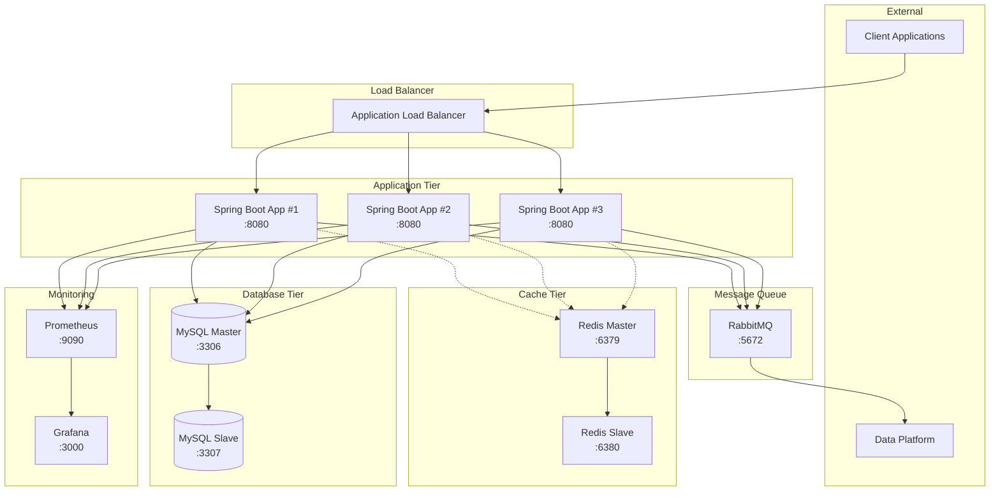

# 인프라 구성도

## 개요
E-Commerce 상품 주문 서비스의 인프라 아키텍처 설계입니다.
확장성, 가용성, 성능을 고려한 클라우드 네이티브 구조로 설계되었습니다.

## 전체 아키텍처



## 주요 컴포넌트

### 1. Application Load Balancer (ALB)
**역할**: 트래픽 분산 및 고가용성 보장

**기능**:
- 여러 애플리케이션 인스턴스에 트래픽 분산
- Health Check를 통한 장애 인스턴스 제외
- SSL/TLS 종료
- 고정 세션(Sticky Session) 지원

**설정**:
```yaml
# nginx.conf 예시
upstream backend {
    least_conn;
    server app1:8080 max_fails=3 fail_timeout=30s;
    server app2:8080 max_fails=3 fail_timeout=30s;
    server app3:8080 max_fails=3 fail_timeout=30s;
}

server {
    listen 80;
    location / {
        proxy_pass http://backend;
        proxy_set_header X-Real-IP $remote_addr;
        proxy_set_header X-Forwarded-For $proxy_add_x_forwarded_for;
    }
}
```

### 2. Spring Boot Application Tier
**역할**: 비즈니스 로직 처리

**구성**:
- **인스턴스 수**: 3개 (최소 구성)
- **포트**: 8080
- **JVM 설정**: 힙 메모리 2GB, G1GC
- **프로필**: production

**특징**:
- Stateless 설계로 수평 확장 가능
- Docker 컨테이너로 배포
- 분산 락을 위한 Redis 연동

### 3. Cache Tier (Redis)
**역할**: 성능 향상 및 분산 락 제공

**구성**:
- **Master-Slave 구조**
- **Master**: 읽기/쓰기 처리
- **Slave**: 읽기 전용 복제본

**용도**:
- 상품 정보 캐싱 (TTL: 1시간)
- 인기 상품 통계 캐싱 (TTL: 10분)
- 분산 락 구현 (재고 관리)
- 세션 스토어 (확장 시)

**설정 예시**:
```yaml
# application.yml
spring:
  redis:
    master:
      host: redis-master
      port: 6379
    slave:
      host: redis-slave
      port: 6380
  cache:
    type: redis
    redis:
      time-to-live: 3600000 # 1시간
```

### 4. Message Queue (RabbitMQ)
**역할**: 비동기 처리 및 외부 시스템 연동

**구성**:
- **Exchange**: topic 타입
- **Queue**: order.completed, data.platform
- **DLQ**: 실패한 메시지 처리

**용도**:
- 주문 완료 이벤트 발행
- 외부 데이터 플랫폼 전송
- 판매 통계 업데이트

**메시지 플로우**:
```
주문 완료 → order.completed Queue → Data Platform Consumer
                                 → Statistics Consumer
```

### 5. Database Tier (MySQL)
**역할**: 데이터 영구 저장 및 관리

**구성**:
- **Master-Slave 복제**
- **Master**: 읽기/쓰기
- **Slave**: 읽기 전용 (통계, 조회)

**설정**:
```sql
-- Master 설정
SET GLOBAL binlog_format = 'ROW';
SET GLOBAL log_bin = ON;

-- Slave 설정  
CHANGE MASTER TO
  MASTER_HOST='db-master',
  MASTER_USER='replication',
  MASTER_PASSWORD='password',
  MASTER_LOG_FILE='mysql-bin.000001',
  MASTER_LOG_POS=0;
```

**연결 풀 설정**:
```yaml
spring:
  datasource:
    hikari:
      maximum-pool-size: 10
      minimum-idle: 5
      connection-timeout: 10000
      max-lifetime: 60000
```

### 6. Monitoring (Prometheus + Grafana)
**역할**: 시스템 모니터링 및 알림

**메트릭 수집**:
- **애플리케이션**: JVM 메트릭, 비즈니스 메트릭
- **데이터베이스**: 커넥션 풀, 쿼리 성능
- **캐시**: 히트율, 메모리 사용량
- **메시지 큐**: 큐 길이, 처리량

**주요 대시보드**:
- 시스템 리소스 (CPU, 메모리, 디스크)
- 애플리케이션 성능 (응답시간, TPS)
- 비즈니스 메트릭 (주문 수, 매출)

## 배포 아키텍처

### Docker Compose 구성
```yaml
version: '3.8'
services:
  nginx:
    image: nginx:alpine
    ports:
      - "80:80"
    volumes:
      - ./nginx.conf:/etc/nginx/nginx.conf

  app1:
    image: ecommerce-app:latest
    environment:
      - SPRING_PROFILES_ACTIVE=production
      - SERVER_PORT=8080
    depends_on:
      - db-master
      - redis-master

  db-master:
    image: mysql:8.0
    environment:
      MYSQL_ROOT_PASSWORD: password
      MYSQL_DATABASE: ecommerce
    volumes:
      - db-data:/var/lib/mysql

  redis-master:
    image: redis:7-alpine
    ports:
      - "6379:6379"
    command: redis-server --appendonly yes

  rabbitmq:
    image: rabbitmq:3-management
    environment:
      RABBITMQ_DEFAULT_USER: admin
      RABBITMQ_DEFAULT_PASS: password
```

## 보안 구성

### 1. 네트워크 보안
- **VPC**: 프라이빗 서브넷에 데이터베이스 배치
- **Security Group**: 포트 기반 접근 제어
- **SSL/TLS**: HTTPS 통신 강제

### 2. 애플리케이션 보안
- **JWT 토큰**: 인증/인가 (향후 구현)
- **Rate Limiting**: API 호출 제한
- **Input Validation**: 요청 데이터 검증

### 3. 데이터 보안
- **암호화**: 중요 데이터 필드 암호화
- **백업**: 일일 자동 백업
- **접근 제어**: 최소 권한 원칙

## 확장성 고려사항

### 수평 확장
- **Auto Scaling**: CPU/메모리 사용률 기반
- **Container Orchestration**: Kubernetes 도입 고려
- **Database Sharding**: 데이터 분산 저장

### 성능 최적화
- **CDN**: 정적 리소스 캐싱
- **Connection Pool**: 커넥션 최적화
- **Query Optimization**: 인덱스 튜닝

## 장애 대응 전략

### 1. 고가용성 (High Availability)
- **Multi-AZ 배포**: 가용 영역 분산
- **Health Check**: 자동 장애 감지
- **Failover**: 자동 장애 조치

### 2. 백업 및 복구
- **Database Backup**: 일일 자동 백업
- **Point-in-Time Recovery**: 특정 시점 복구
- **Disaster Recovery**: 재해 복구 계획

### 3. 모니터링 및 알림
- **실시간 모니터링**: 24/7 시스템 감시  
- **알림 규칙**: 임계치 기반 알림
- **로그 집중화**: ELK 스택 활용

## 비용 최적화

### 1. 리소스 최적화
- **Right Sizing**: 적정 인스턴스 크기
- **Reserved Instance**: 예약 인스턴스 활용
- **Spot Instance**: 개발/테스트 환경

### 2. 자동화
- **Infrastructure as Code**: Terraform 활용
- **CI/CD**: 자동 배포 파이프라인
- **Auto Scaling**: 트래픽 기반 자동 확장/축소

## 운영 가이드

### 1. 배포 절차
1. 코드 커밋 → GitHub Actions 트리거
2. Docker 이미지 빌드 → Container Registry 업로드
3. Rolling Update → 무중단 배포
4. Health Check → 배포 검증

### 2. 장애 대응
1. 알림 수신 → 1차 대응 (5분 내)
2. 원인 분석 → 임시 조치
3. 근본 원인 해결 → 재발 방지책

### 3. 정기 점검
- **주간**: 성능 모니터링, 로그 분석
- **월간**: 보안 패치, 백업 검증  
- **분기**: 용량 계획, 아키텍처 리뷰