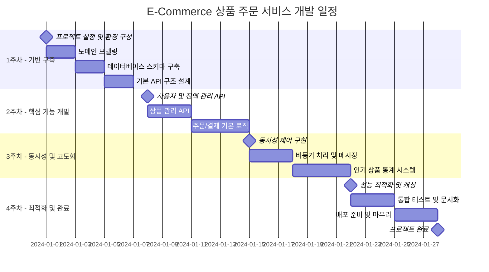

# 마일스톤 계획

## 프로젝트 개요
**프로젝트명**: E-Commerce 상품 주문 서비스  
**기간**: 4주 (2024.01.01 ~ 2024.01.28)  
**목표**: 동시성을 고려한 안전한 상품 주문 시스템 구축

## 전체 마일스톤 타임라인

## 마일스톤 상세 계획

### 🏗️ Milestone 1: 기반 구축 (1주차)
**기간**: 2024.01.01 ~ 2024.01.07  
**목표**: 프로젝트 기반 인프라 및 아키텍처 구축

#### 주요 작업
- [x] **프로젝트 설정** (1일)
  - Spring Boot 프로젝트 초기화
  - Gradle 빌드 구성
  - Docker 환경 설정
  - CI/CD 파이프라인 기본 구성

- [x] **도메인 모델링** (2일)
  - 도메인 엔티티 설계 (User, Product, Order, OrderItem)
  - 비즈니스 규칙 정의
  - 도메인 서비스 인터페이스 설계

- [x] **데이터베이스 스키마** (2일)
  - MySQL 데이터베이스 설계
  - JPA 엔티티 매핑
  - 초기 데이터 마이그레이션 스크립트
  - 인덱스 전략 수립

- [x] **기본 API 구조** (2일)
  - REST API 기본 구조 설계
  - 공통 응답 포맷 정의
  - 예외 처리 핸들러 구현
  - API 문서화 설정 (Swagger)

#### 완료 기준
- [ ] 로컬 개발환경에서 애플리케이션 정상 구동
- [ ] 데이터베이스 연결 및 기본 CRUD 동작 확인
- [ ] 기본 API 엔드포인트 접근 가능
- [ ] CI/CD 파이프라인 빌드 성공

---

### 💰 Milestone 2: 핵심 기능 개발 (2주차)
**기간**: 2024.01.08 ~ 2024.01.14  
**목표**: 기본적인 비즈니스 로직 구현

#### 주요 작업
- [ ] **사용자 및 잔액 관리** (3일)
  - 사용자 등록/조회 API
  - 잔액 충전 API 구현
  - 잔액 조회 API 구현
  - 잔액 변경 이력 관리
  - 단위 테스트 작성

- [ ] **상품 관리** (2일)
  - 상품 목록 조회 API
  - 상품 상세 조회 API
  - 페이징 및 정렬 기능
  - 상품 재고 관리 기본 로직

- [ ] **주문/결제 기본 로직** (2일)
  - 주문 생성 API 기본 구현
  - 결제 처리 로직
  - 주문 조회 API
  - 주문 상태 관리

#### 완료 기준
- [ ] 모든 기본 API 정상 동작
- [ ] Postman/Swagger를 통한 API 테스트 완료
- [ ] 단위 테스트 커버리지 80% 이상
- [ ] 기본 시나리오 테스트 통과

---

### ⚡ Milestone 3: 동시성 및 고도화 (3주차)
**기간**: 2024.01.15 ~ 2024.01.21  
**목표**: 동시성 제어 및 시스템 안정성 확보

#### 주요 작업
- [ ] **동시성 제어 구현** (4일)
  - 비관적 락을 활용한 재고 관리
  - 낙관적 락을 활용한 잔액 관리
  - 분산 락 구현 (Redis)
  - 동시성 테스트 시나리오 작성 및 검증

- [ ] **비동기 처리** (2일)
  - RabbitMQ 연동
  - 주문 완료 이벤트 발행
  - 외부 데이터 플랫폼 연동 (Mock)
  - 재시도 메커니즘 구현

- [ ] **인기 상품 통계** (1일)
  - 판매 통계 집계 로직
  - 인기 상품 조회 API
  - 통계 데이터 캐싱 전략

#### 완료 기준
- [ ] 100명 동시 주문 시나리오 테스트 통과
- [ ] 재고 오버플로우 발생하지 않음
- [ ] 외부 시스템 연동 정상 동작
- [ ] 성능 테스트 통과 (TPS 500 이상)

---

### 🚀 Milestone 4: 최적화 및 완료 (4주차)
**기간**: 2024.01.22 ~ 2024.01.28  
**목표**: 성능 최적화 및 프로덕션 준비

#### 주요 작업
- [ ] **성능 최적화** (3일)
  - Redis 캐싱 전략 구현
  - 데이터베이스 쿼리 최적화
  - 커넥션 풀 튜닝
  - JVM 메모리 최적화

- [ ] **통합 테스트** (2일)
  - End-to-End 테스트 작성
  - 성능 테스트 (JMeter)
  - 장애 시나리오 테스트
  - 보안 테스트

- [ ] **배포 준비** (2일)
  - Docker 이미지 최적화
  - 프로덕션 환경 설정
  - 모니터링 대시보드 구성
  - 문서 정리 및 배포 가이드 작성

#### 완료 기준
- [ ] 전체 기능 통합 테스트 통과
- [ ] 성능 요구사항 달성 (응답시간 < 500ms, TPS > 1000)
- [ ] 프로덕션 환경 배포 성공
- [ ] 운영 가이드 문서 완료

---

## 위험 요소 및 대응 방안

### 🚨 주요 위험 요소

#### 1. 동시성 처리 복잡성
**위험도**: 높음  
**영향**: 재고 오버플로우, 잔액 처리 오류  
**대응 방안**:
- 단계적 락 전략 적용 (비관적 → 분산락)
- 충분한 동시성 테스트 시간 확보
- 페어 프로그래밍으로 코드 리뷰 강화

#### 2. 성능 목표 미달성
**위험도**: 중간  
**영향**: 사용자 경험 저하, 서비스 품질 이슈  
**대응 방안**:
- 초기 아키텍처 단계에서 성능 고려
- 정기적인 성능 테스트 실시
- 캐싱 전략 조기 도입

#### 3. 외부 시스템 연동 지연
**위험도**: 중간  
**영향**: 데이터 플랫폼 연동 기능 지연  
**대응 방안**:
- Mock 서버 우선 구현
- 인터페이스 기반 설계로 구현체 분리
- 비동기 처리로 시스템 독립성 확보

#### 4. 테스트 시간 부족
**위험도**: 중간  
**영향**: 품질 저하, 버그 발생 위험  
**대응 방안**:
- 개발과 테스트 병행 진행
- 자동화된 테스트 환경 구축
- 테스트 우선 개발 (TDD) 적용

---

## 단계별 검증 방법

### 1주차 검증
- [x] **코드 리뷰**: 아키텍처 설계 적절성 검토
- [x] **기능 데모**: 기본 CRUD 동작 확인
- [ ] **문서 리뷰**: API 명세서, ERD 검토

### 2주차 검증
- [ ] **단위 테스트**: 각 API별 테스트 케이스 실행
- [ ] **통합 테스트**: API 간 연동 테스트
- [ ] **성능 기초 측정**: 기본 응답 시간 측정

### 3주차 검증
- [ ] **동시성 테스트**: 100명 동시 사용자 시뮬레이션
- [ ] **부하 테스트**: 목표 TPS 달성 여부 확인
- [ ] **장애 시나리오**: 외부 시스템 장애 상황 테스트

### 4주차 검증
- [ ] **성능 테스트**: 최종 성능 목표 달성 확인
- [ ] **보안 테스트**: 취약점 스캔 및 점검
- [ ] **사용자 시나리오**: 전체 사용자 플로우 검증

---

## 프로젝트 성공 지표

### 기능적 지표
- [x] **API 완성도**: 4개 주요 API 100% 구현
- [ ] **테스트 커버리지**: 85% 이상
- [ ] **문서화 완성도**: API 명세서, ERD, 인프라 구성도 완성

### 비기능적 지표
- [ ] **성능**: 평균 응답시간 < 500ms
- [ ] **처리량**: TPS > 1000
- [ ] **동시성**: 100명 동시 주문 처리 성공률 100%
- [ ] **가용률**: 99.9% 이상

### 비즈니스 지표
- [ ] **정확성**: 재고/잔액 계산 정확도 100%
- [ ] **데이터 무결성**: 주문-결제-재고 간 일관성 100%
- [ ] **실시간성**: 외부 데이터 전송 지연시간 < 5초

---

## 리소스 할당

### 개발 리소스
- **백엔드 개발**: 1명 (풀타임)
- **데이터베이스 설계**: 0.3명 (1주차 집중)
- **인프라 구성**: 0.2명 (지속적)

### 인프라 리소스
- **개발 서버**: Spring Boot Application Server
- **데이터베이스**: MySQL 8.0
- **캐시**: Redis 7.0
- **메시지 큐**: RabbitMQ 3.11
- **모니터링**: Prometheus + Grafana

### 외부 의존성
- **데이터 플랫폼 API**: Mock 구현 후 실제 연동
- **결제 시스템**: 내부 잔액 시스템으로 대체
- **인증 시스템**: 1차 구현에서 제외, 2차 확장시 적용

이 마일스톤 계획을 통해 체계적이고 안전한 e-커머스 주문 시스템을 구축할 예정입니다. 각 단계별 목표 달성과 지속적인 품질 검증을 통해 성공적인 프로젝트 완성을 목표로 합니다.