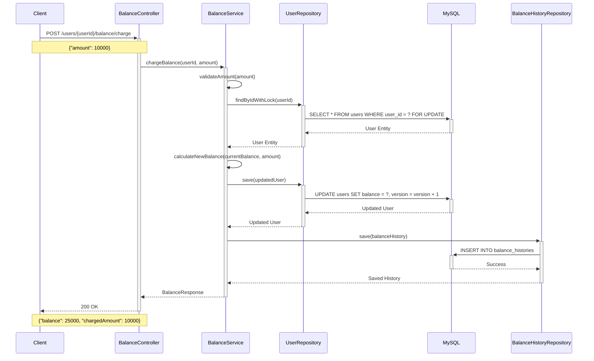
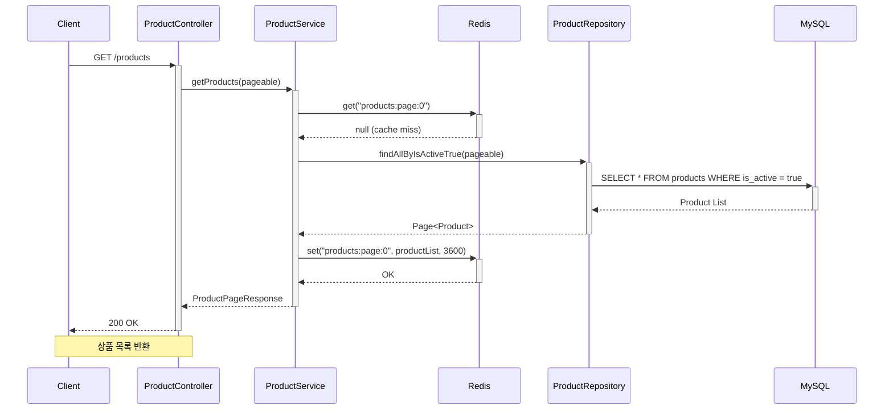
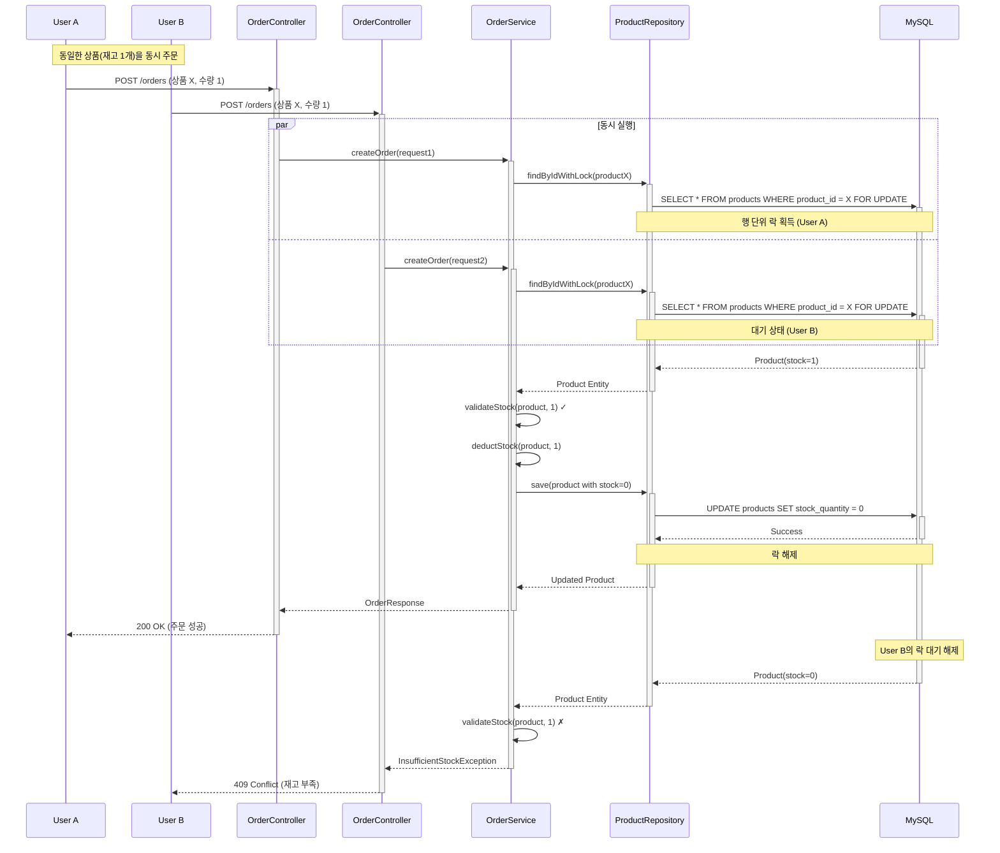
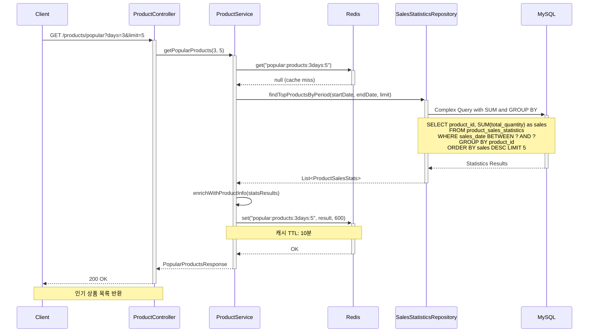
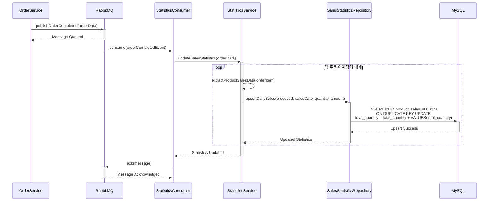

# 시퀀스 다이어그램

## 개요
E-Commerce 상품 주문 서비스의 주요 시나리오별 시퀀스 다이어그램입니다.
각 API의 상호작용과 데이터 플로우를 시각적으로 표현합니다.

## 1. 잔액 충전 시퀀스



## 2. 상품 조회 시퀀스



## 3. 주문 및 결제 시퀀스 (동시성 포함)

```mermaid
sequenceDiagram
    participant Client
    participant Controller as OrderController
    participant Service as OrderService
    participant UserRepo as UserRepository
    participant ProductRepo as ProductRepository
    participant OrderRepo as OrderRepository
    participant DB as MySQL
    participant MQ as RabbitMQ
    participant External as DataPlatform

    Client->>+Controller: POST /orders
    Note over Client,Controller: {"userId": 1, "orderItems": [...]}
    
    Controller->>+Service: createOrder(orderRequest)
    
    Note over Service: 트랜잭션 시작
    Service->>+UserRepo: findByIdWithLock(userId)
    UserRepo->>+DB: SELECT * FROM users WHERE user_id = ? FOR UPDATE
    DB-->>-UserRepo: User Entity
    UserRepo-->>-Service: User Entity
    
    loop 각 주문 상품에 대해
        Service->>+ProductRepo: findByIdWithLock(productId)
        ProductRepo->>+DB: SELECT * FROM products WHERE product_id = ? FOR UPDATE
        DB-->>-ProductRepo: Product Entity
        ProductRepo-->>-Service: Product Entity
        
        Service->>Service: validateStock(product, quantity)
        Service->>Service: calculateSubtotal(price, quantity)
    end
    
    Service->>Service: calculateTotalAmount(orderItems)
    Service->>Service: validateBalance(user, totalAmount)
    
    alt 잔액 충분 && 재고 충분
        Service->>Service: deductBalance(user, totalAmount)
        Service->>+UserRepo: save(updatedUser)
        UserRepo->>+DB: UPDATE users SET balance = ?, version = version + 1
        DB-->>-UserRepo: Success
        UserRepo-->>-Service: Updated User
        
        loop 각 상품 재고 차감
            Service->>Service: deductStock(product, quantity)
            Service->>+ProductRepo: save(updatedProduct)
            ProductRepo->>+DB: UPDATE products SET stock_quantity = ?
            DB-->>-ProductRepo: Success  
            ProductRepo-->>-Service: Updated Product
        end
        
        Service->>+OrderRepo: save(order)
        OrderRepo->>+DB: INSERT INTO orders, order_items
        DB-->>-OrderRepo: Saved Order
        OrderRepo-->>-Service: Order Entity
        
        Note over Service: 트랜잭션 커밋
        
        Service->>+MQ: publishOrderCompleted(order)
        MQ-->>-Service: Message Sent
        
        MQ->>+External: 주문 데이터 전송
        External-->>-MQ: Acknowledgment
        
        Service-->>-Controller: OrderResponse
        Controller-->>-Client: 200 OK
        
    else 잔액 부족 또는 재고 부족
        Note over Service: 트랜잭션 롤백
        Service-->>-Controller: BusinessException
        Controller-->>-Client: 409 Conflict
        Note over Controller,Client: {"code": "INSUFFICIENT_BALANCE/STOCK"}
    end
```

## 4. 동시 주문 처리 시퀀스 (Race Condition 방지)



## 5. 인기 상품 조회 시퀀스



## 6. 외부 데이터 플랫폼 전송 시퀀스

```mermaid
sequenceDiagram
    participant OrderService
    participant MQ as RabbitMQ
    participant Consumer as DataPlatformConsumer
    participant External as DataPlatform
    participant DLQ as DeadLetterQueue
    participant Monitor as Monitoring

    OrderService->>+MQ: publishOrderCompleted(orderData)
    Note over OrderService,MQ: 주문 완료 이벤트 발행
    MQ-->>-OrderService: Message Queued
    
    MQ->>+Consumer: consume(orderCompletedEvent)
    Consumer->>Consumer: validateMessage(event)
    
    Consumer->>+External: HTTP POST /orders
    Note over Consumer,External: 외부 데이터 플랫폼 전송
    
    alt 전송 성공
        External-->>-Consumer: 200 OK
        Consumer->>+MQ: ack(message)
        MQ-->>-Consumer: Message Acknowledged
        
    else 전송 실패 (일시적)
        External-->>-Consumer: 500 Internal Server Error
        Consumer->>Consumer: wait(exponentialBackoff)
        Consumer->>+MQ: nack(message, requeue=true)
        MQ-->>-Consumer: Message Requeued
        Note over Consumer,MQ: 재시도 3회까지
        
    else 전송 실패 (영구적)
        External-->>-Consumer: 400 Bad Request
        Consumer->>+DLQ: send(message)
        DLQ-->>-Consumer: Message to DLQ
        Consumer->>+Monitor: alert(failedMessage)
        Monitor-->>-Consumer: Alert Sent
        Consumer->>+MQ: ack(message)
        MQ-->>-Consumer: Message Acknowledged
    end
```

## 7. 판매 통계 업데이트 시퀀스



## 시퀀스 다이어그램 주요 포인트

### 1. 동시성 제어
- **비관적 락**: 재고 관리를 위한 `SELECT FOR UPDATE` 사용
- **낙관적 락**: 사용자 잔액 관리를 위한 version 필드 활용
- **분산 락**: Redis를 활용한 분산 환경 동시성 제어 (향후 구현)

### 2. 트랜잭션 관리
- **@Transactional**: Spring의 선언적 트랜잭션
- **격리 수준**: READ_COMMITTED로 성능과 일관성 균형
- **롤백 전략**: 비즈니스 예외 발생 시 자동 롤백

### 3. 비동기 처리
- **메시지 큐**: 주문 완료 이벤트의 비동기 처리
- **재시도 메커니즘**: 지수 백오프로 외부 API 호출 안정성
- **데드레터큐**: 처리 실패 메시지의 별도 관리

### 4. 캐싱 전략
- **Cache-Aside 패턴**: 애플리케이션에서 캐시 제어
- **TTL 설정**: 데이터 특성에 맞는 만료시간 설정
- **캐시 무효화**: 데이터 변경 시 관련 캐시 삭제

### 5. 오류 처리
- **비즈니스 예외**: 도메인 규칙 위반 시 명확한 예외 응답
- **시스템 예외**: 인프라 오류에 대한 적절한 예외 처리
- **보상 트랜잭션**: 실패한 작업의 롤백 처리